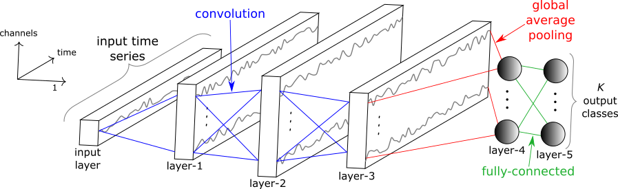

  <h1 id="main-title" style="color:#2c3e50; font-family: 'Segoe UI', Tahoma, Geneva, Verdana, sans-serif; font-size:3rem; margin-top:40px; margin-bottom:40px; text-shadow:1px 1px 2px rgba(0,0,0,0.1);">
    课题组学习指南
  </h1>

## 目录

<nav>
  <ul>
    <li><a href="#chapter1">第一章 课题组介绍</a></li>
    <li><a href="#chapter2">第二章 入门深度学习</a></li>
    <li><a href="#chapter3">第三章 具身智能ROS</a></li>
  </ul>
</nav>
<h2 id="chapter1">第一章 课题组介绍</h2>
<!-- 这里是课题组介绍内容 -->
实验室资料见QQ群---主要是仪器使用教程、历届毕业论文、内部培训资料

<h2 id="chapter2">第二章 入门深度学习</h2>
<!-- 这里是入门深度学习内容 -->
* 必备知识 
  * Linux、Pytorch、408
* 建议书籍
  
* 入门视频
  * 吴恩达机器学习
  * Pytorch小土堆
* IDE
  * VScode/Pycharm
  * VScode+Anaconda+CUDA+Pytorch SSH服务器配置
* 实战代码项目
  * Transformer
  * CNN
  * Mamba
  * Diffusion Model
  * Clip
  * LLM
  * ...
<h2 id="chapter3">第三章 具身智能ROS</h2>
<!-- 这里是具身智能ROS内容 -->
### 更多信息直接访问
📘 本项目参考：<a href="https://github.com/TianxingChen/Embodied-AI-Guide">Embodied-AI-Guide</a>

Lumina具身智能社区: [点击访问](https://lumina-embodied.ai)

* 具身智能基础技术路线-YunlongDong [2]: [PDF](./files/具身智能基础技术路线-YunlongDong.pdf), [bilibili](https://www.bilibili.com/video/BV1d5ukedEsi/?buvid=XXCD799C01878A6CFDECF3FB4427E2F070877&from_spmid=default-value&is_story_h5=false&mid=iWFclAyh36UYMh2G6ZcsDw%3D%3D&p=1&plat_id=114&share_from=ugc&share_medium=android&share_plat=android&share_session_id=9c0dccf5-ec0b-4369-8b89-ff1d848467ee&share_source=WEIXIN&share_tag=s_i&spmid=united.player-video-detail.0.0&timestamp=1716466406&unique_k=Q0CaIUj&up_id=249218043)

* 社交媒体:

  * 可以关注的公众号: **石麻日记 (超高质量!!!)**, 机器之心, 新智元, 量子位, Xbot具身知识库, 具身智能之心, 自动驾驶之心, 3D视觉工坊, 将门创投, RLCN强化学习研究, CVHub

  * AI领域值得关注的博主列表 [3]: [zhihu](https://zhuanlan.zhihu.com/p/682110383)

* Robotics实验室总结 [4]: [zhihu_1](https://zhuanlan.zhihu.com/p/682671294?utm_psn=1782122763157188608), [zhihu_2](https://zhuanlan.zhihu.com/p/682692024?utm_psn=1782122945184796672)

* 具身智能会投稿的较高质量会议与期刊：Science Robotics, TRO, IJRR, JFR, RSS, IROS, ICRA, ICCV, ECCV, ICML, CVPR, NeurIPS, ICLR, AAAI, ACL等。

* 斯坦福机器人学导论：[website](https://www.bilibili.com/video/BV17T421k78T/?spm_id_from=333.337.search-card.all.click)

* 共建全网最全具身智能知识库 [6]: [website](https://yv6uc1awtjc.feishu.cn/wiki/WPTzw9ON0ivIVrkLjVocNZh8nLf)

* Awesome-Embodied-AI-Job (具身智能招贤榜): [Repo](https://github.com/StarCycle/Awesome-Embodied-AI-Job/tree/main)

* 具身智能华人高引榜: [Repo](https://github.com/Will-Gao/Embodied_Intelligence)
  
* 社区:
  * Lumina具身智能社区: [website](https://lumina-embodied.ai)
  * DeepTimber Robotics Innovations Community, 深木科研交流社区: [website](https://gamma.app/public/DeepTimber-Robotics-Innovations-Community-A-Community-for-Multi-m-og0uv8mswl1a3q7?mode=doc)
  * 宇树具身智能社群: [website](https://www.unifolm.com/#/)
  * Simulately: Handy information and resources for physics simulators for robot learning research: [website](https://simulately.wiki/)
  * DeepTimber-地瓜机器人社区: [website](https://developer.d-robotics.cc/forumList?id=156&title=Deeptimber)
  * HuggingFace LeRobot (Europe, check the Discord): [website](https://github.com/huggingface/lerobot)
  * K-scale labs (US, check the Discord): [website](https://kscale.dev/)
